<!-- Stock Market Dashboard README - Enhanced -->

<!-- 1. Custom Banner -->
<p align="center">
  
</p>

<!-- 2. Reliable Shields.io Badges -->
<p align="center">
  
  
  
  
  
  
  
  
  
  
</p>

<!-- Typing Animation -->
<p align="center">
  
</p>

---

## 📊 Features

| 📥 Data Ingestion       | 🛠️ Data Transformation   | 📊 Visualization      | 📈 Portfolio Simulation | 🖥️ Web Dashboard      | 🐳 Docker Support      |
|------------------------|--------------------------|-----------------------|------------------------|-----------------------|-----------------------|
| Real-time & historical | Technical indicators     | Candlestick, line     | Track investments      | Streamlit/Flask app   | Containerization      |
| CSV/JSON/REST sources  | Normalization, scaling   | Interactive charts    | Strategy backtesting   | User authentication   |                       |

---

## 🚀 Quick Start

```bash
# Clone the repository
git clone https://github.com/vannu07/Stock-market.git
cd Stock-market

# Install dependencies
pip install -r requirements.txt

# Run the dashboard
python app.py
```

<details>
  <summary>How to run with Docker</summary>

  ```bash
  docker build -t stock-market .
  docker run -p 8501:8501 stock-market
  ```
</details>

---

## 🏗️ Project Structure

```
Stock-market/
├── assets/                # Images, GIFs, and branding
├── data/                  # Data sources
├── src/
│   ├── analysis/          # Analysis scripts
│   ├── visualization/     # Chart rendering
│   ├── utils/             # Helper functions
│   └── app.py             # Main dashboard app
├── notebooks/             # Jupyter notebooks
├── requirements.txt       # Python dependencies
├── Dockerfile             # Containerization config
├── README.md              # Documentation
└── LICENSE                # License info
```

---

## 🛠️ Tech Stack

- 
- 
- 
- 
- 
- 
- 

---


## 📈 Sample Visualization

<p align="center">
  
</p>
---

## 🏗️ Architecture

```mermaid
graph LR
    A[📊 Stock Data] --> B[🔍 Data Transformation]
    B --> C[⚙️ Indicator Calculation]
    C --> D[📈 Visualization]
    D --> E[🌐 Dashboard]
    E --> F[📈 Portfolio Tracking]
    F --> G[🐳 Docker Deployment]
```



---

## 📊 Project Stats

<p align="center">
  
  
  
</p>

---

## 🤝 Social & Contact Links

<p align="center">
  <a href="https://linkedin.com/in/vannu07">
    
  </a>
  <a href="https://github.com/vannu07">
    
  </a>
  <a href="mailto:your.email@example.com">
    
  </a>
</p>

---

## 🤝 Contributing

1. Fork the repository
2. Create your feature branch (`git checkout -b feature/AmazingFeature`)
3. Commit your changes (`git commit -m 'Add some AmazingFeature'`)
4. Push to the branch (`git push origin feature/AmazingFeature`)
5. Open a Pull Request

---

## 📄 License

This project is licensed under the **MIT License** – see [LICENSE](LICENSE).

---

## 🌟 Show Your Support

**⭐ Star this repo if you found it useful!**

<p align="center">
  
  
</p>

---

<!-- 10. Footer Wave Animation -->
<p align="center">
  
</p>
